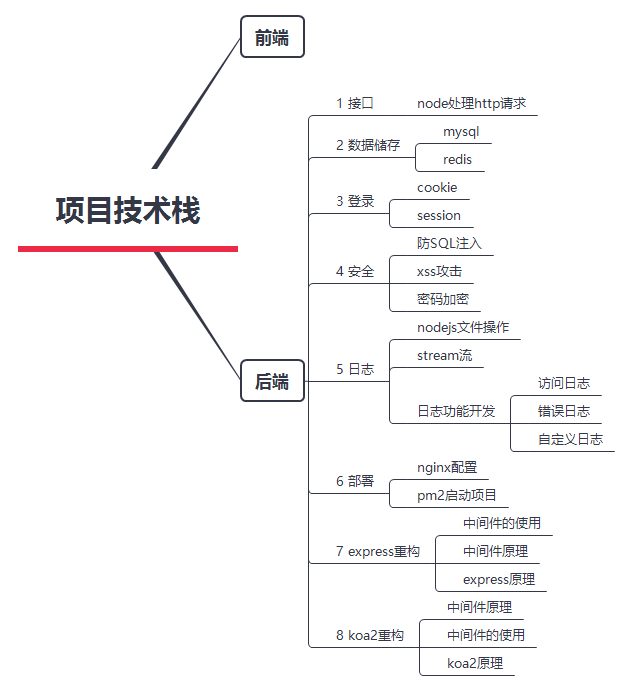
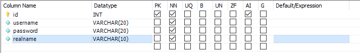
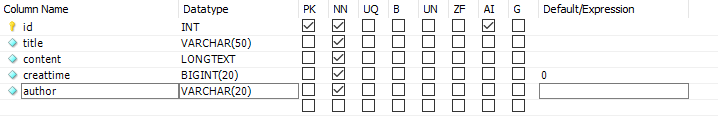
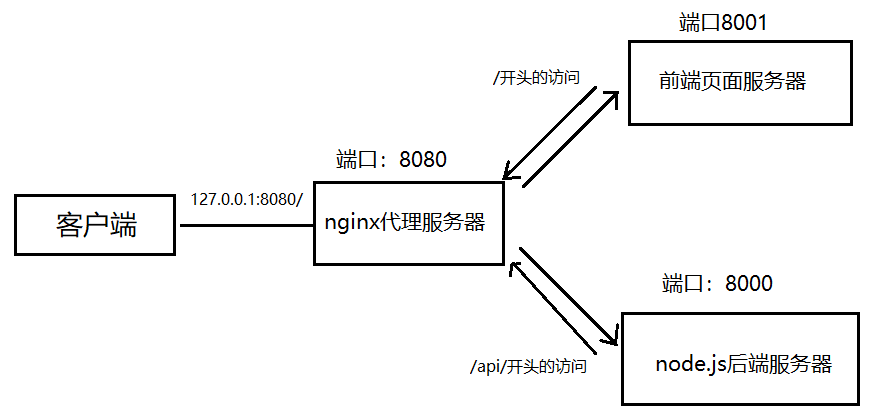
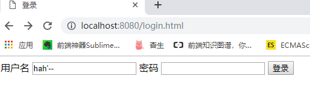
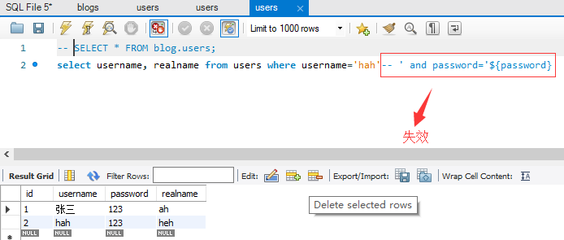
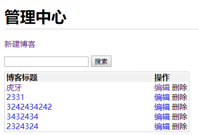
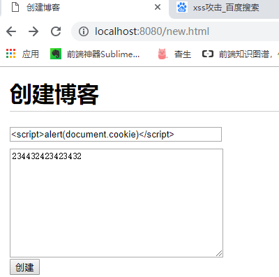
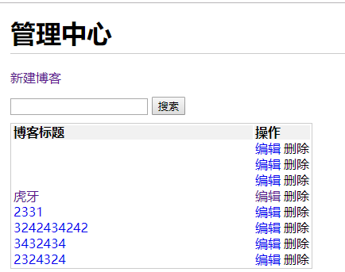

# node.js从零开发web server

## 1 项目结构

打印目录结构：

```
windows tree命令只有两个参数
/f /a
命令行	
tree -d	只显示文件夹
tree -D	显示文件的最后修改时间
tree -L n	n表示显示项目的层级，n=3即只显示项目的三层结构
tree -I pattern	pattern表示想要过滤的目录，例如 tree -I “node_modules”可以过滤掉node_modules这个文件夹
```

```
│  app.js--------------------------入口文件
│  package-lock.json---------------版本锁定
│  package.json--------------------包管理
├─bin
│      www.js  --------------------创建http-server   
├─logs
│      access.log------------------访问日志
│      error.log-------------------错误日志
│      event.log-------------------自定义事件日志
src
    ├─config
    │      db.js   ----------------环境变量配置  
    ├─controller
    │      blog.js ----------------博客数据处理
    │      user.js  ---------------用户数据处理   
    ├─db
    │      mysql.js ---------------连接mysql数据库
    │      redis.js ---------------连接redis数据库    
    ├─model
    │      resModel.js ------------响应模型     
    ├─router
    │      blog.js ----------------博客路由
    │      user.js ----------------用户路由    
    └─utils
            cryp.js ---------------密码加密
            log.js ----------------创建日志
```

项目流程


## 2 技术栈



## 3  需求

首页、作者主页、博客详情页

登录页

管理中心，新建页、编辑页

## 4 接口设计

| 描述               | 接口             | 请求方法 | url参数      | 备注                     |
| ------------------ | ---------------- | -------- | ------------ | ------------------------ |
| 获取博客列表       | /api/blog/list   | get      | 作者，关键字 | 参数为空，不进行查询过滤 |
| 获取一篇博客的内容 | /api/blog/detail | get      | id           |                          |
| 新增一篇博客       | /api/blog/new    | post     |              | post中有新增的信息       |
| 更新一篇博客       | /api/blog/update | post     | id           | postData中有更新的内容   |
| 删除一篇博客       | /api/blog/del    | post     | id           |                          |
| 登录               | /api/user/login  | post     |              | postData中有用户名和密码 |

## 5 不使用框架开发

www.js创建http服务器

router.js处理路由

blog.js处理相应请求的逻辑

controller下面的blog.js获取相应的数据


### 5.1  项目初始化

npm init -y 

### 5.2 开发接口

```javascript
//博客接口
const handleBlogRouter=(req,res)=>{
  const method=req.method

  const url=req.url

  const path=url.split('?')[0]

  //获取博客列表
  if(method==='GET'&&path==='/api/blog/list'){
    return {
      msg:'这是获取博客列表的接口'
    }
  }
  //获取博客详情
  if (method==='GET'&&path==='/api/blog/detail') {
    return{
      msg:'这是获取博客详情的接口'
    }
  }
  // 新建一篇博客
  if (method==='POST'&&path==='/api/blog/new') {
    return{
      msg:'这是新建博客的接口'
    }
  }
  // 更新博客
   if (method==='POST'&&path==='/api/blog/update') {
    return{
      msg:'这是更新博客的接口'
    }
  }
  // 删除博客
   if (method==='POST'&&path==='/api/blog/del') {
    return{
      msg:'这是删除博客的接口'
    }
  }
}

module.exports = handleBlogRouter
```

### 5.3 调试接口

get请求在地址栏即可调试

post请求采用postMan进行调试

网页能够返回设置的msg，则接口没问题


### 5.4 解析query

引入node.js原生模块querystring

`querystring` 模块提供用于解析和格式化 URL 查询字符串的实用工具

```
查询字符串 'foo=bar&abc=xyz&abc=123' 被解析为
{
  foo: 'bar',
  abc: ['xyz', '123']
}
返回的是一个对象
```

### 5.5  model模型

为了将数据处理成规定的格式

```javascript
class BaseModel {
  constructor (data,message){
    //传入的data要为对象，message为字符串类型
    //假设只传入了一个字符串
    if(typeof data==='string'){
      this.message=data
      data=null
      message=null
    }
    if (data) {
      this.data=data
    }
    if (message) {
      this.message=message
    }
  }
}


class SuccessModel extends BaseModel{
  constructor(data,message){
    super(data,message)
    this.errno=0
  }
}

class ErrorModle extends BaseModel{
  constructor(data,message){
    super(data,message)
    this.errno=-1
  }
}

module.exports={
  SuccessModel,
  ErrorModle
}
```

### 5.6 获取数据

在controller文件夹中创建相应的文件，主要是获取数据

```javascript
const getList=(author,keyword)=>{
  //先返回假数据(格式是正确的)
  return [
      {
        id:1,
        title:'标题',
        content:'内容',
        createTime:123321,
        author:'zhangsan'
      },
       {
        id:2,
        title:'标题',
        content:'内容',
        createTime:34243,
        author:'hahsd'
      }
  ]
}
const getDetail=(id)=>{
  //先返回假数据
  return  {
            id:1,
            title:'标题',
            content:'内容',
            createTime:123321,
            author:'zhangsan'
          }
     
}
const newBlog=(blogData={})=>{
  //blogData是一个博客对象，包含title content属性
  
  return {
    id:3//表示新建博客，插入到数据表里面的id
  }
}

const updateBlog=(id,blogData={})=>{
  //id 表示要更新博客的id
  //blogData是一个博客对象，包含title content属性
  
  return true 
}

const delBlog=(id)=>{
  //id就是要删除博客的id
  return true
}


module.exports={
  getList,
  getDetail,
  newBlog,
  updateBlog,
  delBlog
}
```

## 6 连接数据库

### 6.1 可视化软件

mysql workbench 

地址：<https://dev.mysql.com/downloads/file/?id=485462>

### 6.2 连接数据库

用户名root

password 123456

### 6.3  操作数据库

建库

建表

创建用户表



创建博客表




表操作

```sql
select version();--查看mysql版本
use 数据库名字--进入数据库
show tables--显示数据库所有的表
SELECT * FROM myblog.users;--查看数据库某个表

--插入数据
insert into users(username,`password`,realname)values('zhangsan','123','zhangsan');
--查询数据
select id,username from users
--条件查询
select 内容 from users where 
--更新内容
SET SQL_SAFE_UPDATES=0--先执行该语句
update users set realname='sads'where username='zhangsan'--where代表更新的位置
--删除数据
delete from users where id='1'
```

### 6.4 问题

mysql不能输入中文

```sql
show variables like '%character%';
--查看当前字符集的变量值
```

报错 you are using safe update mode...

执行SET SQL＿SAFE_UPDATES=0


## 7 node.js操作数据库

###  7.1 安装插件

cnpm i mysql --save

### 7.2 连接数据库

```javascript
const mysql = require('mysql')

//创建链接对象
const con = mysql.createConnection({
    host:'localhost',
    user:'root',
    password:'123456',
    port:'3006',
    database:'blog'
})

//开始连接
con.connect()

//执行sql语句
const sql='select * from users;'
con.query(sql,(err,result)=>{
    if(err){
        console.error(err)
        return
    }
    console.log(result)
})
//关闭连接
con.end()
```

## 8 api 对接数据库

### 8.1 封装连接数据库函数

```javascript
const mysql=require('mysql')
const{MYSQL_CONF}=require('../config/db.js')

//创建链接对象
const con=mysql.createConnection(MYSQL_CONF)

//开始链接
con.connect()

//统一执行上SQL函数

function exec(sql){
  const promise=new Promise((resolve,reject)=>{
    con.query(sql,(err,result)=>{
      if (err) {
        reject(err)
        return
      }
      resolve(result)
    })
  })
  return promise

}

module.exports={
  exec
}
```

### 8.2 编写SQL语句

对接api，在control中的blog.js编写

传入查询参数，拼接查询SQL语句，执行SQL语句，返回promise对象

```javascript
const { exec } = require('../db/mysql.js')

//传入作者和关键字，拼接SQL语句
const getList=(author,keyword)=>{
  let sql=`select * from blogs where 1=1 `
  if (author) {
    sql+=`and author='${author}' `
  }
  if(keyword){
    sql+=`and title like '%${keyword}%' `
  }
  sql+=`order by createtime desc;`
  //返回promise
  return exec(sql)
}
```

### 8.3 修改路由

在router文件的blog.js中，修改路由处理

```javascript
  if(method==='GET'&&req.path==='/api/blog/list'){
    const author=req.query.author||''

    const keyword =req.query.keyword||''

    // const listData=getList(author,keyword)

    // return new SuccessModel(listData)
    const result =getList(author,keyword)
    result.then(listData=>{
      return new SuccessModel(listData)
    })   
  }
```

### 8.4  app.js修改路由

## 9 登录

功能：登录校验&登录信息储存

### 9.1 cookie

储存在浏览器的一段字符串（最大5kb）

跨域不共享

每次发送http请求，会将请求域的cookie一起发送给server

server可以修改cookie并返回浏览器

### 9.2 server端操作cookie

解析cookie

```javascript
req.cookie={}
//获取cookie，在req.headers.cookie中
  const cookieStr=req.headers.cookie||''//cookie是键值对的字符串
 //拆分cookie，解析成对象
  cookieStr.split(';').forEach(item=>{
    if (!item) {
      return
    }
    const arr=item.split('=')
    const key=arr[0].trim()
    const val=arr[1].trim()
    req.cookie[key]=val
  })
```

设置cookie

```javascript
res.setHeader('Set-Cookie',`username=${data.username}; path=/`)
//限制客户端修改cookie
res.setHeader('Set-Cookie',`username=${data.username}; path=/；httpOnly`)
//设置cookie有效时间expires，默认为关闭浏览器时

const getCookieExpires=()=>{
  const d=new Date()
  d.setTime(d.getTime()+(24*60*60*1000))
  
  return d.toGMTString()
}
res.setHeader('SetCookie',`username=${data.username};path=/;httpOnly;expires=${getCookieExpires()}`)
```

cookie登录验证

```javascript
if (method==='GET'&&req.path==='/api/user/login-test') {
    if (req.cookie.username) {
      return Promise.resolve(new SuccessModel())
    }
    return Promise.resolve(new ErrorModle('尚未登录'))
  }
```

### 9.3 session

```javascript
  //解析session
  let needSetCookie=false
  let userId=req.cookie.userId
  if (userId) {
    if (!SESSION_DATA[userId]) {
      SESSION_DATA[userId]={}
    }
  } else {
      needSetCookie=true
      userId=`${Date.now()}_${Math.random()}`
      SESSION_DATA[userId]={}
  }

  req.session=SESSION_DATA[userId]
```

session的问题

1. 目前session直接是js变量，放在node.js进程内存中，进程内存有限，当访问量过大，内存就会暴增，引起js进程崩溃
2. 正式线上运行是多进程，进程之间内存无法共享
3. 当项目重启时，session就会丢失

### 9.4 redis

1. 本地要先安装redis数据库，还需要启动数据库
   在redis的安装目录下，执行redis-server，双击即可，命令行启动不知道
2. 安装redis   执行npm i redis --save

```javascript
//客户端操作
keys * 查看所有数据
flushall //清空数据
//查看某个key对应的值
get key(这是个值)
```

连接测试

```javascript
const redis = require('redis')

// 创建客户端
const redisClient = redis.createClient(6379, '127.0.0.1')
redisClient.on('error', err => {
    console.error(err)
})

// 测试
redisClient.set('myname', 'zhangsan2', redis.print)
redisClient.get('myname', (err, val) => {
    if (err) {
        console.error(err)
        return
    }
    console.log('val ', val)

    // 退出
    redisClient.quit()
})
```

node封装redis函数

```javascript
const redis = require('redis')
//由于这里环境变量配置有问题，暂时不使用环境变量
// const {REDIS_CONF}=require('../conf/db')

const redisClient = redis.createClient(6379, '127.0.0.1')
redisClient.on('error', err => {
    console.error(err)
})

function set(key,val){
  if (typeof val==='object') {
    val=JSON.stringify(val)
  }
  redisClient.set(key,val,redis.print)
}
function get(key){
  const promise= new Promise((resolve,reject)=>{
    redisClient.get('key', (err, val) => {
        if (err) {
            reject(err)
            return
        }
        if (val==null) {
            resolve(null)
            return
        }
        try{
          resolve(JSON.parse(val))

        }catch(ex){

          resolve(val)
        }
        

    })
  })

  return promise
}

module.exports={
  set,
  get
}

```

### 9.5  在blog中修改信息

在新建博客，更新博客、删除博客中创建登录验证，验证通过才可以执行操作

## 10 连接前端

```javascript
//全局安装http-server
npm i http-server -g
//设置访问端口
http-server -p 端口
//进入文件目录输入
http-server
```

通过http-server创建一个服务器打开前端的html页面，端口为8001，

通过启动node.js的www.js文件创建了一个后端服务器，端口为8000.

这里有两个服务器，端口不同，前端页面访问后端服务器就属于跨域，此时采用反向代理服务器nginx，通过nginx解决跨域问题

### 10.1 nginx

一般用于做静态服务、负载均衡

反向代理

反向代理配置

```
请求根目录代理到静态页面的服务器
location / {
            proxy_pass http://localhost:8001;
        }
请求api代理到node.js服务器
location /api/ {
		   proxy_pass http://localhost:8000;
            proxy_set_header Host $host;
        }
```



## 11 日志

### 11.1 日志内容

1. 访问日志access log（server端最重要的日志）
2. 自定义日志（包括自定义事件，错误记录等）

### 11.2 node.js 文件操作 

日志存储在文件中

node.js stream

### 11.3 日志功能开发

访问日志

```javascript
const fs= require('fs')

const path =require('path')


// 写日志
function writeLog(writeStream,log){
  writeStream.write(log+'\n')
}

//生成write stream
function createWriteStream(fileName){
  const fullFileName=path.join(__dirname,'../','../','logs',fileName)
  const writeStream=fs.createWriteStream(fullFileName,{
    flags:'a'
  })
  return writeStream
}

//写访问日志

const accessWriteStream=createWriteStream('access.log')

function access(log){
  writeLog(accessWriteStream,log)
}

module.exports={
  access
}
```

### 11.4 拆分日志

按时间划分日志文件

实现方法：linux的crontab命令，即定时任务

在linux系统执行

```
设置定时任务，格式*****command
将access.log拷贝并重命名为2019-02-10.access.log
清空access.log文件，继续积累日志
```

### 11.5 分析日志

使用nodejs的readline(基于stream，效率高)

## 12 安全

### 12.1 sql注入

SQL注入是指针对web应用使用的数据库，通过运行非法的SQL而产生的攻击

攻击方式：输入一个SQL片段最终拼接成一段攻击代码

比如登录SQL注入，在登录名输入 hah'-- 。此时在后台拼接的SQL语句就会把--后面的内容作为注释，此时就可以不用密码登录







防止SQL注入的方法

使用mysql的escape函数，对输入的内容进行转义，使特殊字符失效

```javascript
username=escape(username)
password=escape(password)
```

### 12.2 xss攻击

攻击方式：在页面展示内容参杂js代码，以获取网页信息

预防措施：转换生成js的特殊字符

npm i xss --save

```javascript
//此时将title的特殊内容进行转义
const title=xss(blogData.title)
```

xss攻击演示：在新建博客中的标题输入一段js代码，此时就会执行这段代码






当采用xss转义之后，标题的内容就不会解析成js代码


### 12.3 密码加密

数据库泄露，用户信息泄露，需要对数据库加密

```javascript
//nodejs自带加密模块
const crypto=require('crypto')

//密匙
const SECRET_KEY='sdsa#f'

//md5加密

function md5(content){
  let md5=crypto.createHash('md5')

  return md5.update(content).digest('hex')
}


//加密函数
function genPassWord(password){
  const str=`password=${password}&key=${SECRET_KEY}`
  return md5(str)
}
```

## 13 express开发

### 13.1 安装

使用express-generator脚手架工具一键生成开发环境

```javascript
npm i express-generator -g
//初始化项目
express 项目名称
//安装依赖包
npm install
npm start
//安装mysql xss
cnpm i myslq xss --save
```

安装nodemon 和 cross-env

```
cross-env
运行跨平台设置和使用环境变量的脚本
当您使用NODE_ENV =production, 来设置环境变量时，大多数Windows命令提示将会阻塞(报错)。 （异常是Windows上的Bash，它使用本机Bash。）同样，Windows和POSIX命令如何使用环境变量也有区别。 使用POSIX，您可以使用：$ ENV_VAR和使用％ENV_VAR％的Windows。
说人话：windows不支持NODE_ENV=development的设置方式。
cross-env使得您可以使用单个命令，而不必担心为平台正确设置或使用环境变量。 只要在POSIX系统上运行就可以设置好，而cross-env将会正确地设置它。
说人话: 这个迷你的包(cross-env)能够提供一个设置环境变量的scripts，让你能够以unix方式设置环境变量，然后在windows上也能兼容运
```

```javascript
//在packjson中配置
"dev":"cross-env NODE_ENV=dev nodemon ./bin/www"
```


### 13.2 数据库

直接拷贝mysql.js和db.js以及controller下的文件

### 3.3 使用中间件express-session和connect-redis

```javascript
//安装
cnpm i express-session --save
//引入
const session = require('express-session')
//配置
app.use(session({
  secret:'sdsa#f',
  cookie:{
    // path:'/',//默认配置
    // httpOnly:true,//默认配置
    maxAge:24*60*60*1000
  }
}))
//详细参数https://github.com/expressjs/session
```

```javascript
cnpm i redis redis-connect --save
//使用redis
const redisStore=require('connect-redis')(session)
const redisClient=require('./db/redis.js')
const sessionStore=new redisStore({
  client:redisClient
})
app.use(session({
  secret:'sdsa#f',
  cookie:{
    // path:'/',//默认配置
    // httpOnly:true,//默认配置
    maxAge:24*60*60*1000
  },
  store:sessionStore

}))
```

### 13.4 日志

access log脚手架工具morgan

用于生成日志，参数详情地址<https://github.com/expressjs/morgan>

## 14 koa2

express中间件是异步函数，koa2原生支持aysnc/await

### 14.1 安装

```
npm i koa-generator -g
Koa2 koa2-test
npm install
npm run dev
```

### 14.2 开发接口

* 实现登录

基于koa-generic-session和koa-redis

安装

cnpm i koa-generic-session koa-redis redis --save

* 开发路由

```javascript
npm i mysql xss
```


* 记录日志

使用morgan

```
npm i koa-morgan
```


## 15 线上部署

### 15.1 pm2

进程守护，系统崩溃自动重启

启动多进程，充分利用CPU和内存

自带日志记录功能

### 15.2 安装

```javascript
npm i pm2 -g
//启动项目
pm2 start file
//重启
pm2 restart file
//查看启动内容
pm2 list
//停止
pm2 stop file
//删除
pm2 delete file
//查看日志
pm2 log file
//查看启动的项目信息
pm2 info file
```

### 15.3 配置

创建pm2.conf.json配置文件，文件内容如下

```json
{
    "apps": {
        "name": "pm2-test-server",
        "script": "app.js",
        "watch": true,
        "ignore_watch": [
            "node_modules",
            "logs"
        ],
        "instances": 4,
        "error_file": "logs/err.log",
        "out_file": "logs/out.log",
        "log_date_format": "YYYY-MM-DD HH:mm:ss"
    }
}
```

然后运行pm2 start pm2.conf.json

### 15.4  多进程

使用原因：操作系统限制一个进程的内存

无法充分利用机器全部内存

无法充分利用多核cpu的优势

缺点：

多进程无法共享内存

解决：

多进程访问一个redis，实现数据共享

## 16 运行项目

```
1 启动mysql mysql绑定的端口：3306
2 启动redis 端口：6379
3 启动nginx 端口：8080
4 启动静态资源服务器 端口：8001
5 启动nodejs服务器 端口：8000
```

